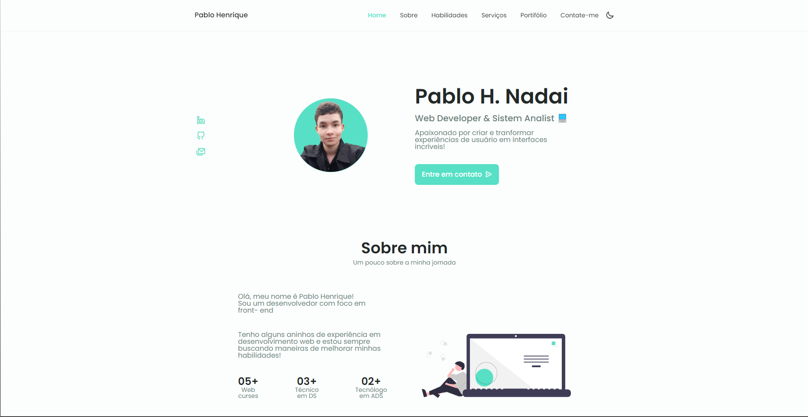
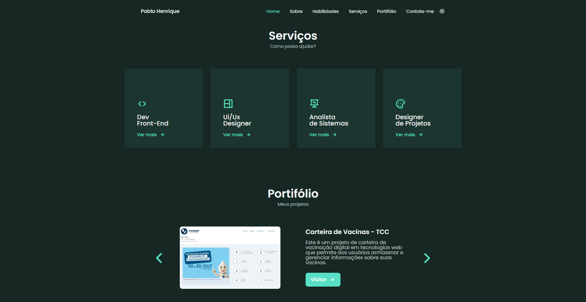

# Meu Portfólio

<p align="justify">Olá! Sou o Pablo Henrique, e desde a infância, encantado por tecnologia. Atualmente, hoje ocupo a posição de Coordenador da Equipe de Suporte Técnico na Contabilivre, onde transformei minha paixão em uma carreira gratificante. Além disso, estou cursando Análise e Desenvolvimento de Sistemas na Faculdade de Tecnologia de Garça - FATEC. Mesmo com um foco maior em Infraestrutura no momento, nunca deixei de lado a programação. Então, colocando os conhecimentos em prática, fiz este projeto!</p>
<br><strong><h3>Vamos lá, seja bem-vindo(a)!</h3></strong><br>

<p align="justify">Este projeto foi desenvolvido utilizando HTML, CSS e JavaScript para apresentar minha experiência profissional, projetos e habilidades de uma maneira interativa. Não utilizei frameworks, mas sim algumas libs JS para gráficos e apresentação de conteúdo!<p>

## Visão Geral

Este portfólio é uma representação digital das minhas conquistas profissionais e projetos. Com uma interface simples e elegante, o objetivo é destacar minhas habilidades e oferecer uma visão abrangente do meu perfil.

## Tecnologias Utilizadas

- HTML
- CSS
- JavaScript
- [Swiper](https://swiperjs.com): Biblioteca para desenvolver carrosséis e galeria de imagens.
- [FormSubmit](https://formsubmit.co): Disparador de e-mails para receber notificações de contato.
- [Chart.js](https://www.chartjs.org): Biblioteca para criação de gráficos interativos.

<div>
	<code></code>
	<code></code>
	<code></code>
</div>

## Como Usar

1. Clone este repositório:

```bash
git clone https://github.com/PabloHenrique/PersonalPortifolio.git
```

## Preview

### Telas
<p>
    
</p>
<p>
    
</p>

<p align="center">Contribuições são bem-vindas! Se você encontrar bugs, melhorias ou tiver sugestões, fique à vontade!<br>Espero que goste 😊</p>
